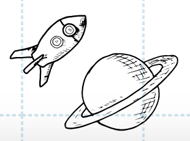
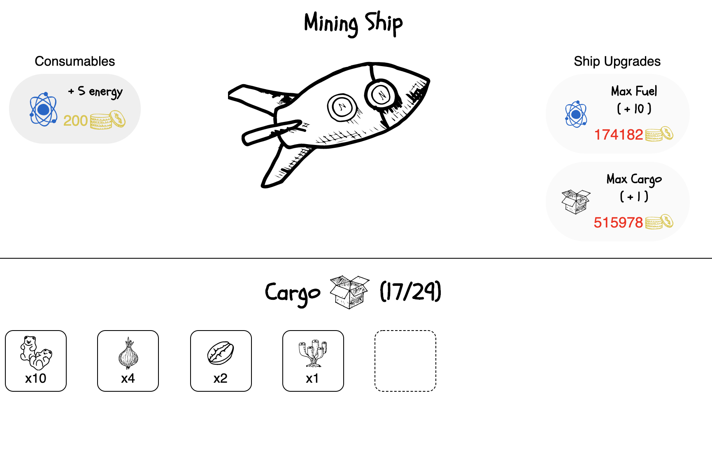
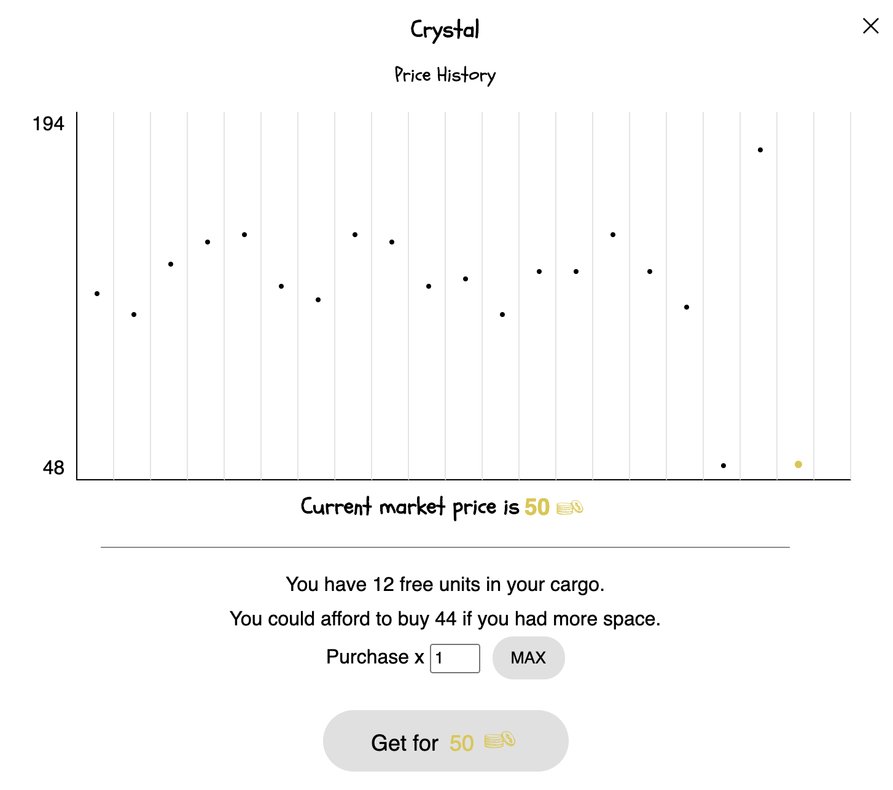

## Welcome to my github profile!
My name is Etienne Giroux (he/him), I'm a recent graduate from a full-stack web development bootcamp at Concordia University in Montreal.

Here is my [LinkedIn profile!](https://www.linkedin.com/in/egiroux/)

Check out my current project:  [Looseleaf Galaxy](http://www.looseleafgalaxy.space) 🚀 

I built the front-end using React and Redux. The backend uses NodeJs and MongoDB.

Some key features: 

Frontend:
- An adorable space clicker game where you mine resources and sell them when the price is as high as possible.
- Buy resources when they are low, sell when they are high.
- Manage your limited inventory to cash in when the opportunity arises!
- Upgrade your shoddy little space ship to travel the galaxy, and to store more cargo!
- Random sectors generated when hopping around the galaxy.

_Trade all sorts of space resources to make space profits and upgrade your ship!!_

Backend:
- A live server for resource market prices that update every hours based on a Google Trends API query.
- My own auth server (using bcrypt and jason web tokens) -- made available in my repos for easy reuse in the future.
- Game data (prices and some game logic) stored on MongoDB.
- Player data stored on MongoDB.

_In Looseleaf Galaxy, prices fluctuate in real time!_

I hope you have fun!

<!--
**eggiroux/eggiroux** is a ✨ _special_ ✨ repository because its `README.md` (this file) appears on your GitHub profile.

Here are some ideas to get you started:

- 🔭 I’m currently working on ...
- 🌱 I’m currently learning ...
- 👯 I’m looking to collaborate on ...
- 🤔 I’m looking for help with ...
- 💬 Ask me about ...
- 📫 How to reach me: ...
- 😄 Pronouns: ...
- ⚡ Fun fact: ...
-->
